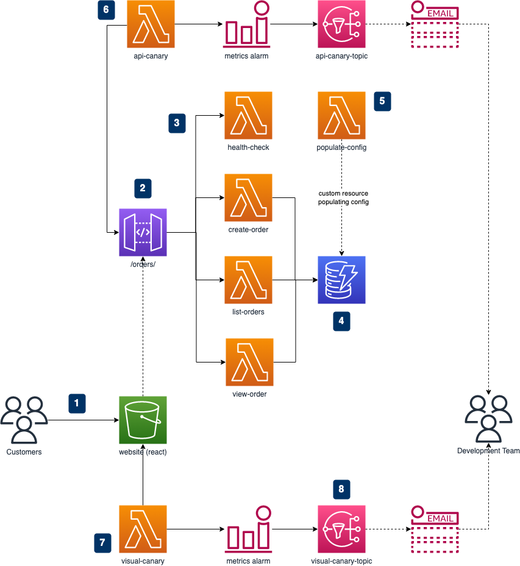

# Serverless AWS CDK Best Practices & Patterns with CDK Pipelines Part 3

An example of creating immutable builds using the AWS CDK and progressing them through environments to production using CDK Pipelines.


This article (Part 3) can be found here:
https://blog.serverlessadvocate.com/serverless-aws-cdk-pipeline-best-practices-patterns-part-3-faa0aca87adb

Part 3 covers:

✔️ We add a very basic React front end for our orders API with a CloudFront distribution, and a Route53 subdomain; which is built and deployed through the pipeline. This allows users too create, list and view orders.

✔️ We cover acceptance tests using Cypress.

✔️ We discuss the use of synthetics in our pipelines, specifically CloudWatch Synthetics, and how to use it with our React app. This will check that our API's and websites are running successfully even when we have no users on the system.

✔️ We cover generating dynamic config within our pipelines for our React app which is stored in S3.


This article (Part 2) can be found here:
https://blog.serverlessadvocate.com/serverless-aws-cdk-pipeline-best-practices-patterns-part-2-5446a417d232

Part 2 code repo can be found here:
https://github.com/leegilmorecode/Serverless-AWS-CDK-Best-Practices-Patterns-Part2

It covered:

✔️ We discuss adding code quality tools locally to the IDE and to the pipeline such as ESLint/TSLint and Prettier (inc pre-commit hooks with Husky) in line with best practices.

✔️ We cover SAST tooling, in particular, cdk-nag in our pipeline to keep us secure from common issues.

✔️ We cover how to put various types of tests in your pipeline at the correct stages (unit, integration and load) to ensure our workloads are working as expected. We will look specifically at Jest, Postman/Newman and Artillery.

✔️ We will cover how to update databases (tables, schemas), seed test data or seed configuration values in the pipeline using custom resources.


Part 1 of the article for this repo can be found here: https://leejamesgilmore.medium.com/serverless-aws-cdk-pipeline-best-practices-patterns-part-1-ab80962f109d

Part 1 code repo can be found here:
https://github.com/leegilmorecode/Serverless-AWS-CDK-Best-Practices-Patterns

It covered:

✔️ We should create different stacks per environment within our CDK app (feature-dev, staging, production etc).

✔️ We should split out stateless and stateful stacks as best practice.

✔️ We should allow for different configurations per stack, without the use of environment variables. (apart from ephemeral environments).

✔️ We should synthesize the app (assets) once, allowing for a deterministic immutable build to be deployed through all environments.

---

## Getting started

We are going to build the following basic application to showcase the use of CDK Pipelines:



The diagram shows that:

1. Customers use our nice website to create, list and view their orders.

2. The React client is hosted from Amazon S3 and utilises our backend orders API.

3. We have Lambda functions for creating, listing and viewing orders; as well as health check endpoint.

4. All of the order information is stored in Amazon DynamoDB.

5. As part of the CDK Pipeline we use a Lambda function backed customer resource which populates our DynamoDB with configuration value for our store locations.

6. We have an API CloudWatch Synthetic Canary which checks our API is operating successfully, regardless of customers being on the website.

7. We have a Visual CloudWatch Synthetic Canary which checks our webpage is displaying correctly, regardless of customers being on the website.
   If we have any issues with the canaries we are email alerted through a CloudWatch alarm and SNS topic combination.

**Note**: This is not production ready and is solely created for discussion points throughout the article.

---

## Deploying

Note: You will need your own domain setup on AWS Route53.

We will deploy through the pipeline for feature-dev, staging and production, and also allow developers to use ephemeral environments based on their current pr number for quick dev environments (_as discussed in the article_).

---

### Deploying the pipeline

Firstly, we need to add the GitHub secret to AWS Secrets Manager in a secret called `github-token` as described here: https://docs.aws.amazon.com/cdk/api/v2/docs/aws-cdk-lib.pipelines.GitHubSourceOptions.html

To deploy the pipeline please run: `npm run deploy:pipeline` after adding your own account IDs in the `pipeline-types.ts` file.

Note: _to destroy please use the `npm run remove:pipeline' script_

---

### Deploying an ephemeral environment

To deploy a developer ephemeral environment:

1. Update the `.env` file and change the `PR_NUMBER` variable value.
2. Run the following command passing in your `PR_NUMBER` (example for 'PR-123' below):

```
cdk deploy ServerlessPro/Develop-PR-123/StatefulStack ServerlessPro/Develop-PR-123/StatelessStack --profile=featuredev
```

Note: _There is an example of this and the tear down in the package.json file for reference. This could easily be scripted_.

---
